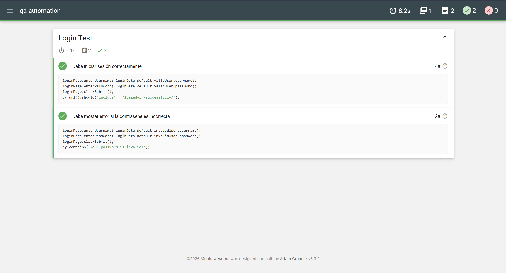

# QA Automation Project - Cypress

Proyecto de automatización de pruebas desarrollado con Cypress aplicando buenas prácticas de testing automation.

---

## Tecnologías utilizadas
- Cypress
- JavaScript
- Node.js

---

## Funcionalidades Automatizadas
- Login exitoso
- Login inválido
- Validación de mensajes de error
- Verificación de URL post-login
- Validación de elementos UI

---

## Buenas prácticas implementadas
- Page Object Model (POM)
- Custom Commands
- Fixtures / Data Driven Testing
- Reporter HTML (Mochawesome)
- Captura de screenshots automática
- Grabación de videos de ejecución

---

## Evidencias

### Ejecución automatizada

### Reporte HTML

---

## Instalación
1. npm install
2. npx cypress open

## Autor 
- Santiago Quintero Tapasco